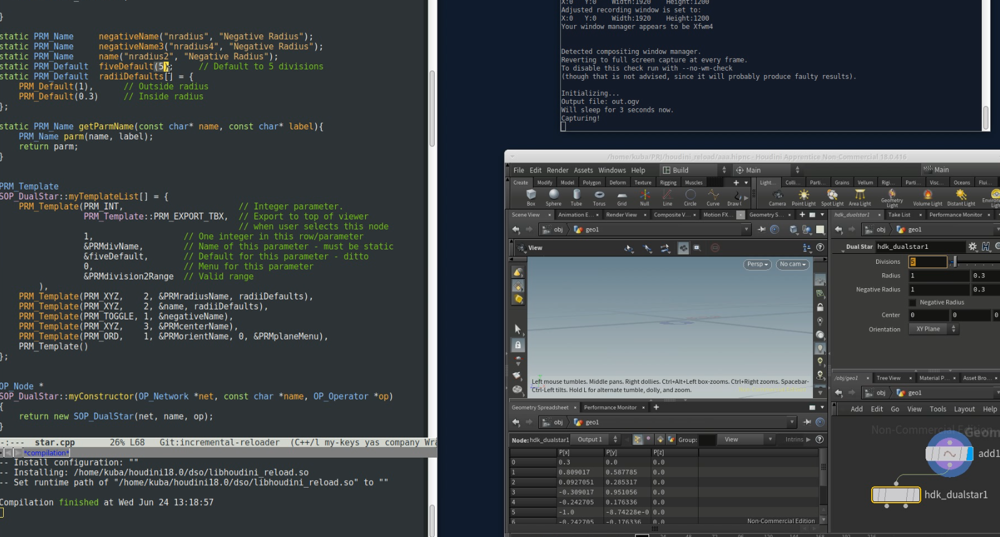

A custom HDK operator example with an option to reload changes at runtime, to retain the state of the loaded scene.
- Updates to GU_Detail are supported.
- Changes to existing parameters should work as well.
- Adding new GUI parameters is currently not possible. (See notes for details).

[](./images/demo1.mp4)

## Build:
Update the CMakeLists.txt to point to Houdini installation directory ($HFS).
The `make install` copies the host shared library to the dso folder inside $HOME/houdini18.0.
```
mkdir __build
cd __build
cmake .. -DCMAKE_INSTALL_PREFIX=$HOME/houdini18.0/dso
make install
```

## NOTES:
- To update an instance of a node in the scene - delete the node and undo the operation- which should pick up changes. 
- The reload is currently associated with the scene reload callback. (see the linked demo1.mp4)

- Houdini OP_OperatorTable - does not handle reloading previously loaded dsos. 
  There some existing references being created during plugin registration (HOM etc) and there is no API (that I know of) to handle this. To workaround this, on every new build we create a new shared object file keeping the plugin internal name (hdk_dualstar) unchanged. Loading a new dso containing same symbols should override and update existing operator (OP_Operator) as expected. 

- As hinted above adding new parameters is at the moment problematic as during plugin registration we are expected to pass pointer to already allocated memory. There is an experimental branch (runtime-parm-update) which instead of static declaration allocates everything in newSopOperator() which does allow adding new parameters. This is currently unstable as it opens up a few issues and will most likely crash due to the following problems
 - does not handle existing internal reference to parameters being removed - it is not possible to remove already allocated parameters. 
 - This version introduces memory leaks to guarantee long enough lifetimes for newly added parameters
 
There is a possible way to improve state of things by at the cost of increasing code bloat of current solution. This would require to increment the internal node type (hdk_dualstar) during each built (and change each time the type  during reload in Houdini session). 

## TODO:
- handle cleanup of generated intermediate dsos
- extract base_name of the file (try to avoid Boost filesystem - missing symbols in shipped version of hboost)
